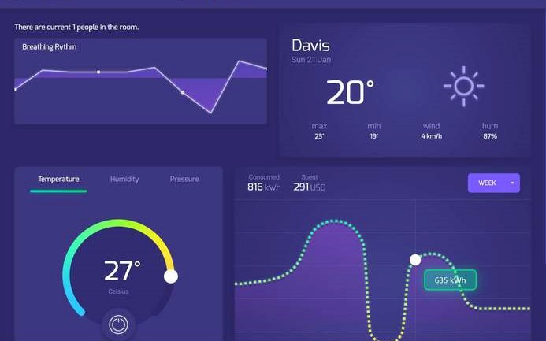

# Self-Regulation AI

# About
Using a combination of sensor feedback and cloud-based analytics tools, it self-regulates rooms to minimize energy usage while maximizing human comfort.

# Tools Used
- Node.js
- Python
- AngularJS
- multi-platform chatbot
- GCP
- AWS
- ML
- Analytics dashboard
- Arduino board
- Walabot board

*Pranav Eranki*
